# 简介
买不起DJI Action 2的我仿造了一台Action 2 Poor  

硬件原理图  
https://oshwhub.com/code504/action_2_poor_v1  

软件源码  
https://gitee.com/dma/action_2_poor  

视频演示  
https://www.bilibili.com/video/BV1ND4y1s7Hr  


# 写在前面
* 想买个便宜运动相机的、零基础的、纯外行之类的人不要看了，直接去买便宜的二手运动相机。
* 想要复刻的一定要考虑清楚，千万不要把它真的当成相机来用，视频中也展示过它的画质，这里我再次强调：它的画质很差！
* 本项目的学习意义大于使用意义，如果你以前没有做过这样的项目并能完整复刻下来，或者能在此基础上做二次开发，那么我相信你一定有巨大收获！


# 目录说明
* doc 为项目文档、图片、部分芯片的数据手册等。
* firmware 为编译好的固件，直接烧录就可以运行，例如uboot、kernel、rootfs等。
* hardware 为硬件相关内容，包括原理图、PCB、外壳模型等。
* software 为软件源码。其中 app 内为各个可独立运行的程序，包括 hello world、camera、功能测试程序等；ext_lib 为第三方库如 lvgl、libmpeg等；hisi_sdk 为海思官方sdk文件；patches 为我修改的u-boot和kernel代码；utils 内为本工程的一些未分类的通用代码。

PCB和原理图仅供参考，后续变更以 https://oshwhub.com/code504/action_2_poor_v1 为准，本工程内的PCB和原理图不再更新。  


# 固件说明
firmware 的目录结构及各个文件说明如下  
```
firmware/
├── camera_img                              # 存放我编译的各类镜像，烧到Flash中就能用
│   ├── rootfs.jffs2                        # 我编译的 rootfs
│   ├── uboot_env.bin                       # u-boot环境变量
│   ├── u-boot-hi3516ev200.bin              # 我编译的 u-boot
│   ├── uImage                              # 我编译的 kernel
│   └── update_pack.tar                     # 升级包示例
├── font                                    # 存放字体文件，大家可以自行修改
│   ├── HarmonyOS_Sans_SC_Regular_L1.ttf    # 中文字体
│   └── Inconsolata-Bold.ttf                # 英文字体
└── hisi_official_img                       # 存放由海思官方代码编译的未做任何修改的镜像，供大家开发测试
    ├── rootfs_hi3516ev200_64k.jffs2        # 由海思官方代码编译的 rootfs
    ├── u-boot-hi3516ev200.bin              # 由海思官方代码编译的 u-boot
    └── uImage_hi3516ev200                  # 由海思官方代码编译的 kernel
```

烧写地址  
| 文件名     | 地址       |
| ---------- | ---------- |
| u-boot     | 0x00000000 |
| u-boot_env | 0x00080000 |
| kernel     | 0x00100000 |
| rootfs     | 0x00500000 |

* 理论上由海思官方代码编译的镜像可以直接跑起来，容量为8MB或16MB常见品牌的Flash都是支持的
* 保守起见，我的镜像修改了u-boot和kernel的Flash驱动，至少可以保证使用W25Q128JVSIQ能正常启动
* 烧写方法灵活多样，flash内有uboot的可以直接用uboot命令烧写，没有uboot的flash（如不小心全片擦除、全新flash、flash内数据损坏等）可以用hisi sdk内的烧写工具或拆下flash用烧写器进行烧写。无论哪种方式只要能烧进去就行，具体操作步骤请自行百度或查阅hisi sdk内相关文档，这里不再赘述。


# 快速入门

## 零代码开发
针对不想写代码或不会写代码的人，这种方式风险极高，遇到问题很难定位。  

### 准备工作
1. 有焊接能力
2. 有flash烧写工具
3. 除被动型元件（电容、电阻等）以外的所有器件型号必须完全一致
4. 特别说明：目前提供的固件触摸屏坐标范围是0到128，坐标原点在右下角，如果你的触摸屏不符合这个参数就必须修改源码

### 开发过程
1. 焊接并组装
2. 按【固件说明】章节的内容烧写camera_img目录下对应的固件，烧写完成后最好校验一遍
3. 上电，如果运气好，2秒钟左右你会看到Logo，15秒左右会黑屏，紧接着白屏，22秒左右开机完成
4. 如果没有开机、开机白屏、开机后卡死等，检查芯片是否焊接良好，如果确认焊接无误，大概率是芯片挂了
5. 如需帮助请留下详细的故障描述以及完整的串口打印日志（波特率115200），特别是串口日志，非常重要！


## 二次开发
我默认你具备足够的软硬件开发经验，能独立解决开发中遇到的各种软硬件问题，一些基础性的东西例如设置uboot环境变量、编写CMake脚本、git常用命令、Linux常用命令等我默认你都会。  

### 准备工作
1. 有足够的C语言开发经验，具备一定Linux基础，有焊接能力
2. 准备海思官方SDK，版本为 Hi3516EV200R001C01SPC012 （这东西是保密的，我不想给自己找麻烦，别找我、我没有、不知道，否认三连。【疯狂暗示：用各种搜索引擎搜索“Hi3516EV200R001C01SPC012”、“海思SDK”、“Hi3516EV200 SDK”等关键字，这里的各种搜索引擎包括但不限于百度、Bing、Google、网盘搜索、磁力搜索、各种论坛的内部搜索、某些购物软件的搜索栏、公众号等】）
3. 按照海思SDK中的说明安装交叉编译工具链 arm-himix100-linux
4. 如果你想要自己编译uboot、kernal、rootfs，请按照海思SDK中的相关文档搭建开发环境；如果不想编译上述内容，可以跳过这个步骤，直接用我提供的
5. 拷贝海思官方SDK内的相关文件，本工程用到以下文件：
	hisi_sdk 内用于存放海思官方sdk文件
	请自行拷贝以下文件到 `hisi_sdk\` 目录内
	Hi3516EV200R001C01SPC012.rar -> Hi3516EV200R001C01SPC012\01.software\board\Hi3516EV200_SDK_V1.0.1.2.tgz -> Hi3516EV200_SDK_V1.0.1.2\package\mpp.tgz -> mpp\
	这个目录下的 include, ko, lib 三个目录


### 编译说明
在 `software/CMakeLists.txt` 中设置海思交叉编译工具链路径  
编译命令  
```
cd ./software
mkdir ./build
cd ./build
cmake ../
make
```


### 运行程序
**有嵌入式linux开发经验的可以自行操作，本章节内容仅供参考**  

烧写完成后需设置uboot环境变量，输入以下命令设置环境变量，保存并重启，正常情况都会成功。  

我编译的镜像使用以下环境变量  
```
setenv bootargs 'mem=36M console=ttyAMA0,115200 clk_ignore_unused rw root=/dev/mtdblock2 rootfstype=jffs2 mtdparts=hi_sfc:1M(u-boot.bin),4M(kernel),11M(rootfs.jffs2)'
setenv bootcmd 'startrgb; sf probe 0; sf read 42000000 100000 400000; bootm 42000000'
setenv bootdelay '1'
saveenv
reset
```
为了加快开机速度可以把 bootdelay 改成 1，但不建议改成 0，你清楚这意味着什么吧？  

海思官方镜像使用以下环境变量  
```
setenv bootargs 'mem=32M console=ttyAMA0,115200 clk_ignore_unused rw root=/dev/mtdblock2 rootfstype=jffs2 mtdparts=hi_sfc:1M(u-boot.bin),4M(kernel),11M(rootfs.jffs2)'
setenv bootcmd 'sf probe 0; sf read 42000000 100000 400000; bootm 42000000'
saveenv
reset
```

**以挂载nfs并运行程序为例**  
linux内核启动后输入以下命令启动网卡、设置IP、网关等  
```
ifconfig lo 127.0.0.1
ifconfig eth0 192.168.1.2 netmask 255.255.255.0
route add default gw 192.168.1.1
```

在虚拟机中安装nfs server，设置有线网卡的ip为`192.168.1.3`，在开发板上挂载nfs（土豪可以用NAS之类的，普通人用linux虚拟机）  
```
mount -t nfs -o nolock 192.168.1.3:/home/nfs /tmp/nfs
```

在nfs server的目录内准备上文提到的ko、lib目录，以及要运行的程序，输入以下命令加载ko  
```
cd /tmp/nfs/ko
./load3516ev200 -i -sensor0 imx335
```
load3516ev200 脚本中的内存可以自行修改，但必须和bootargs的mem保持一致  

输入以下命令设置环境变量  
```
export LD_LIBRARY_PATH=$LD_LIBRARY_PATH:/tmp/nfs/lib
```

运行你的程序  


# 硬件开发

## 硬件成本与采购渠道
如果你打算自己手工焊接，并且使用3D打印外壳，成本最低可以控制在300元以内，但如果你打算正反面全贴片并且使用CNC外壳，那么会直接飙升到一千元，总之就看你的钱包能不能承受得住。  
为避免不必要的麻烦，详细内容以及采购渠道请查看 doc 目录中的《成本估算及采购渠道.xlsx》  

## 打样参数
| 名称           | 层数 | 厚度              | 备注                   |
| -------------- | ---- | ----------------- | ---------------------- |
| 串口网口转接板 | 2    | 无要求，1.6mm即可 | 无                     |
| 屏幕转接板     | 2    | 尽量薄，建议0.8mm | 无                     |
| 副板           | 2    | 建议0.8mm         | 有能力的最好做阻抗匹配 |
| 主板           | 4    | 建议1.0mm         | 有能力的最好做阻抗匹配 |

## 串口与网口转接板
4块PCB中最简单的一块，就是把串口和网口引出来而已，方便调试。串口的作用还用说？网口主要是挂载NFS进行开发调试，不用网口也行，无非就是用SD卡烧写程序测试，但这样做效率太低，而且不能用GDB Server进行调试。  
  

## 显示屏与触摸屏转接板
显示屏与触摸屏通过一块转接小板与主板连接，这样设计有两个原因：  
1. 主板没有多余的面积放置显示屏与触摸屏的接插件
2. 当后期需要更换线其他型号显示屏或触摸屏时，只需重新画转接小板即可

转接板尽量薄一些，这样可以尽可能多得节省内部空间来放置更大容量的电池。这里转接板的厚度为0.8mm，是嘉立创能免费打样的最小厚度。  

**规格型号**  
触摸屏：1.54寸，主控FT6206，6PIN，IIC接口  
显示屏：1.33寸，主控ST7789，12PIN，SPI接口  

**注意事项**  
1. 市面上有很多儿童手表或智能手表的屏幕总成，理论上买这种屏幕是最好的，但我找了多家店铺屏并没有找到合适的屏幕，主要有以下几个原因：没有合适的尺寸；采用BTB接口的屏幕较多，母座难以手工焊接；最重要的一点，没有引脚定义，更不知道触摸屏和显示屏芯片的型号，大多店家只是代理商，他们只负责销售，不是他们不提供资料，是他们也没有资料。如果大家能找到合适的且有完整资料的手表屏幕总成，欢迎分享。（当我整理文档时网上已经可以买到一款1.69寸240x280的屏幕总成了，很多开源项目也在用这款屏幕，但很可惜长度长了一些，不然我就换用这款屏幕了）
2. 显示屏优先选择1.33寸的（有的可能叫1.3寸），不推荐1.44寸和1.54寸。1.44寸的屏幕尺寸比较合适，但分辨率只有128x128，如果你一定要用这款屏幕，那么所有和显示先关的代码都要改，工作量可不小。1.54寸的屏幕显示区域和触屏区域完美重合，但很可惜显示屏的四个角会超出触摸屏一点点，如果显示屏边框是塑料，可以尝试用刀割一点点，如果显示屏是金属外壳就不太好办了。其次是留给触摸屏四周的边框太窄了，和外壳粘接比较困难，还有就是屏幕排线的位置也不太合适，排线距离边框太近，安装时外壳可能会过渡弯折排线导致屏幕损坏。所以我这里只能选用1.33寸的屏幕，这个显示屏和触摸屏之间有大约1.5mm的白边，不易处理，而且显示面积小，确实有点费眼睛。这两种种屏幕对比如下：
   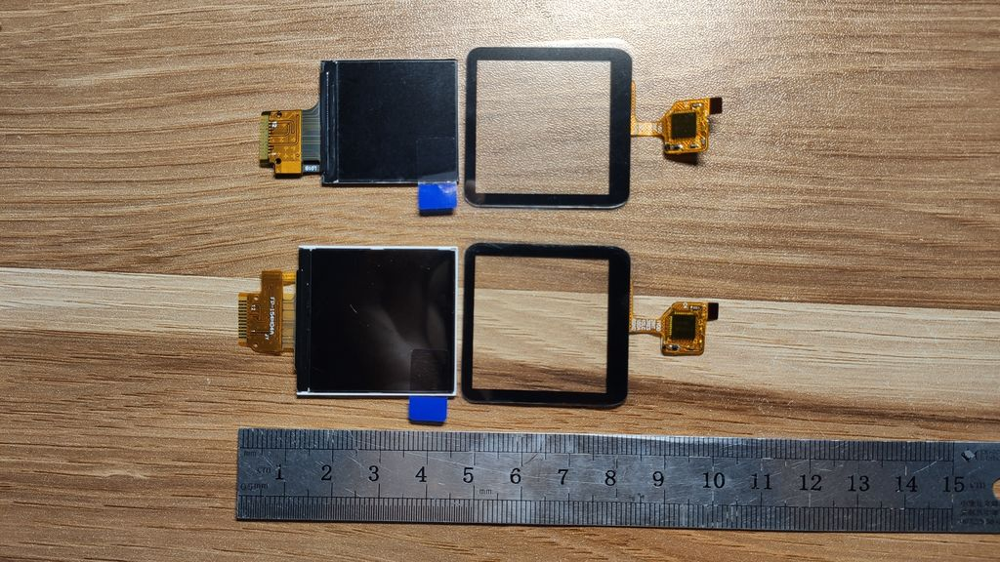  
   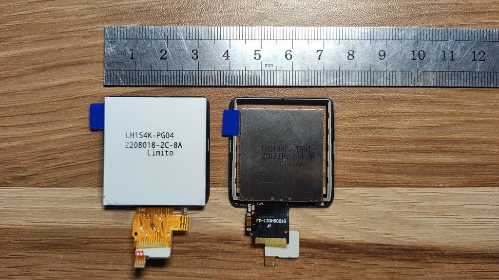  
   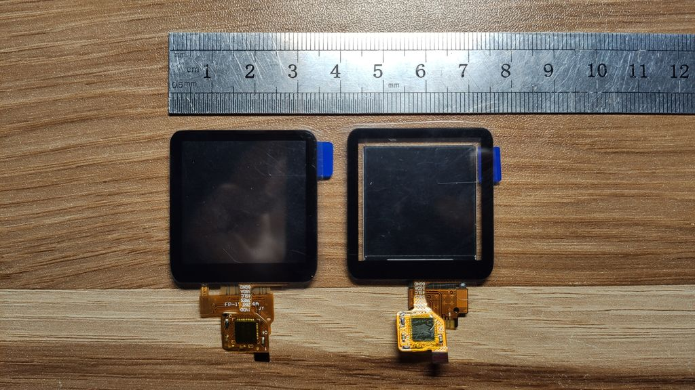  
3. 如果换了不同尺寸的显示屏，最好在代码中校准一下触摸屏和显示屏的坐标，比如我用的1.33寸显示屏比触摸范围小一圈，触摸的横纵坐标应该都减去一定值，具体内容看源码
4. 最开始我打算用黑色的T7000手机屏幕维修专用胶水来粘接显示屏与触摸屏，正好黑色也可以遮挡白边，计划是将胶水涂在显示屏与触摸屏接触面的拐角处，并用胶水覆盖白边，这样粘接的好处是一旦发现触摸屏或显示屏有损坏等情况，除胶拆卸也比较方便。真正粘接前还专门在钢化玻璃贴膜和亚克力上试了试，发现胶水的流动性不强，我以为没问题，实际粘接时发现胶水会渗入屏幕之间，幸亏拆的快，不然这两块屏幕就有可能报废了。所以我最后用3mm宽的黑色的手机维修泡棉双面胶来粘的屏幕，这三边用黑色泡棉胶带呈L形粘贴屏幕边框和触摸屏。
     
5. 如果不打算维修，或不考虑以后进行无损拆解等，可以考虑OCA光学胶，这也是理论上最理想的选择，因为现在几乎所有的手机屏幕都是用这种胶粘的，但实际情况是没有专业工具粘接必然有气泡残留，这胶的粘性还挺强，后期维修拆解困难，残留难以清除（看维修手机的视频就知道这胶有多难处理），所以也不推荐。如果你是个修手机的，手头正好有压屏机，那当我没说。我用两张报废的手机膜做测试，粘接后有气泡残留。
   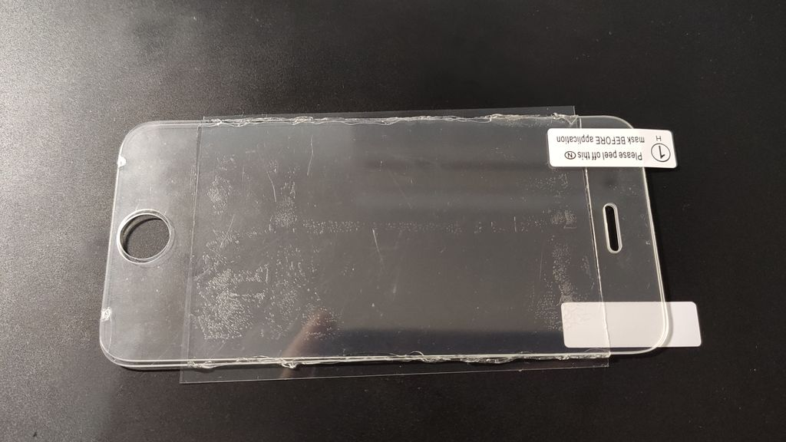  
6. 触摸屏的FPC排线很短，FPC座这里的小突起会压到触摸屏排线，需要把这里剪掉，推荐用指甲刀
   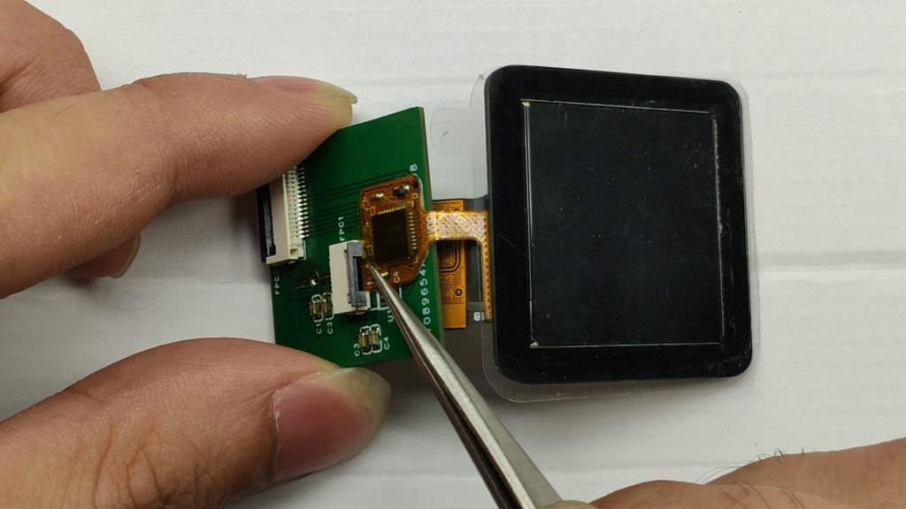  
   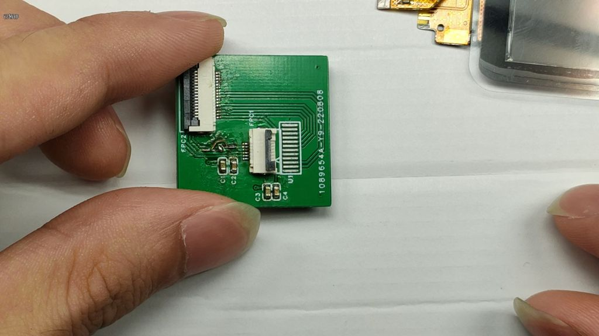  
   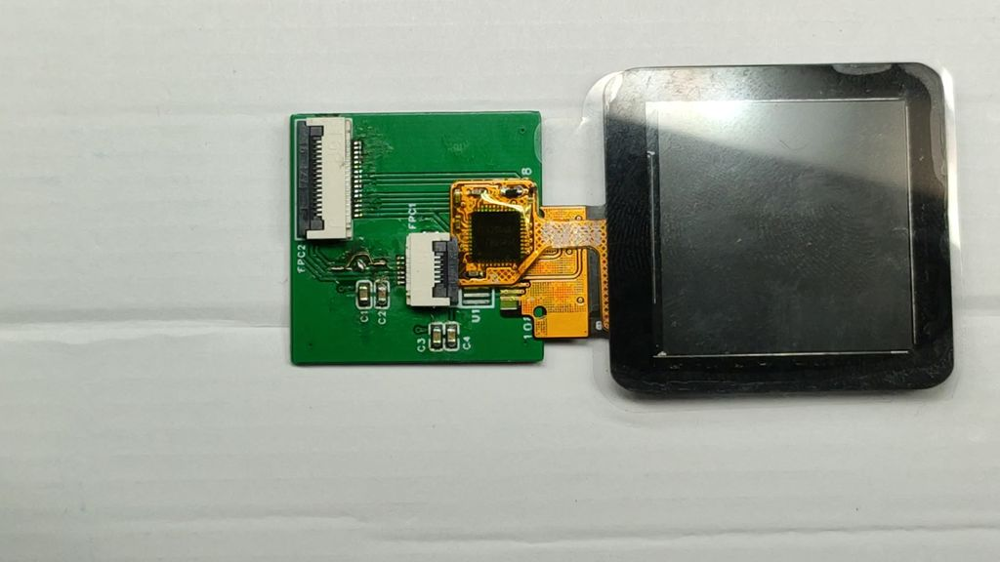  

## 副板
1. 目前没有做回放功能，也没有提示音之类的，可以不焊接功放芯片。
2. type-c有两对信号线，我的PCB中只连接了一对，不影响使用，何况我也没开发USB功能，如有需要请自行修改。
3. USB信号线没做阻抗匹配，如有需要请自行修改。
4. 充电芯片是TP4057，目前设置的充电电流大约为0.36A，且电源输入端加了分压电阻，芯片几乎不发热。如需调整充电电流请注意散热问题。

## 主板
1. 在主板的Flash旁边预留了5V和GND焊盘，开发期间可以用这个焊盘供电，省去电池。也可以给副板的电池引线接上可调电源。
2. 主板左下角和右下角螺丝孔旁边故意没有铺铜，外壳（尤其是CNC外壳）这里如果有弧度正好可以手动把这里磨成圆的。为什么不在PCB里面就做成圆的？因为懒。
3. 主板上其他设计细节请查看原理图中的注释
4. MIPI、ETH、USB信号线需要做阻抗匹配，但是我没做，能用就行。（其实是我不会）
5. 主控我买的二手拆机摄像头，这种价格便宜但不包好坏，有的板子有明显的暴力拆解痕迹，这种芯片完全看运气。

谁呀这么倒霉？怎么这么多芯片都坏了？哎？你们别看我，这个倒霉蛋绝对不是我！我不知道，我没有狡辩，真的不是我！  
  

## FPC排线处理
* FPC排线的长度建议为3CM
* 为了节约PCB面积整个电路设计很紧凑，所有FPC连接器的位置都很靠边，而FPC加强筋又比较长，不方便弯折，所以需要减掉一些加强筋。
* 如果加强筋的金手指比较长，可以直接从加强筋前面减
* 如果加强筋的金手指比较短，需要从后面把加强筋和排线撕开，然后剪短（有的排线质量非常好，加强筋根本撕不开，可以适当加热辅助，如果还撕不开就换个渠道再买一些吧）
* 推荐使用指甲刀剪

剪加强筋之前  
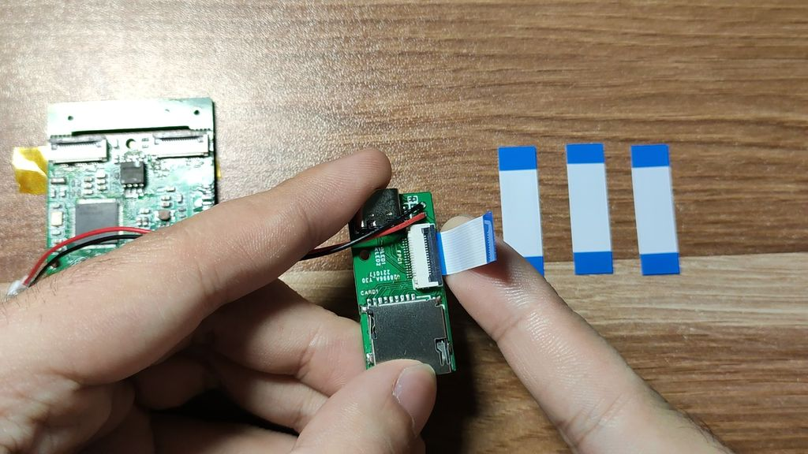  
剪加强筋之后  
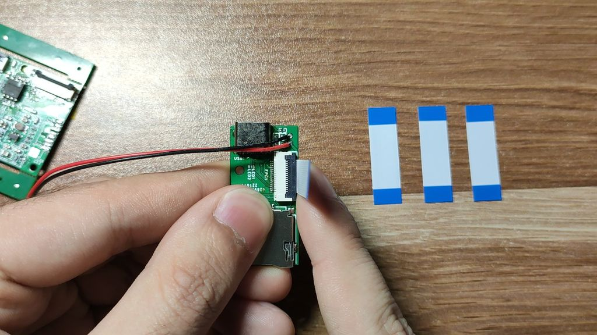  
撕加强筋  
  

## 摄像头处理
摄像头的排线需要弯折，弯折后效果如下，保证摄像头正好在线框位置上，并使用双面胶粘牢  
  

## 主控芯片焊接注意事项
1. 一定要检查，有维修专用显微镜之类的最好，如果没有，最起码也要买个10倍的放大镜，引脚非常小，没有放大镜的话你的眼睛受不了。
2. 有钢网可以直接用热风“木仓”一次性焊好，没有钢网先用热风“木仓”把底部焊盘焊好，再用烙铁焊接引脚（焊接老手直接用热风“木仓”搞定，根本不用烙铁补焊）。
3. 焊接引脚没什么技巧，多多练习，熟练了就好，如果你能顺利手工焊接ESP32，那么焊接这个芯片相对来说也没那么困难。

以下是个人总结的手工焊接建议，仅供参加考  
* 这个芯片的主要来源是拆机芯片，焊接前仔细清理引脚（如果能买到全新，忽略此条）
* 手工烙铁焊接不建议用锡膏，因为在芯片的边角处很容易残留未熔化的锡膏，可能埋下隐患，这些未熔化的锡膏用放大镜仔细检查就能发现，但肉眼基本看不见
* 烙铁头个人觉得用小刀头最合适，其次是小一字头，再其次是特尖头，马蹄头不考虑
* 助焊剂优先推荐BGA专用助焊剂，再其次是一些维修专用助焊剂；不推荐松香（残留多，不方便后期检查），千万不要用一些弱酸性或可能具有轻微导电性的助焊剂，这种助焊剂如果洗不干净隐患无穷
* 少加一点点助焊剂，一点点就行，烙铁头带适量焊锡，从左到右慢慢拖焊，经验丰富的老手用适量的助焊剂和焊锡拖焊一遍就能成功
* 焊接完成后一定要用放大镜仔细检查

这是购买的二手电路板没有拆下芯片之前的样子，焊接效果良好、锡球饱满  
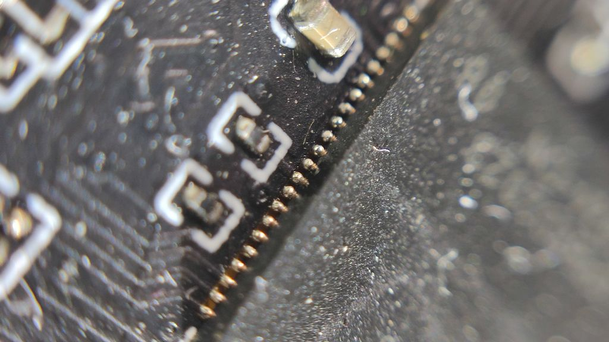  
正常焊接后的效果如下，可以看到QFN侧面引脚都有锡  
  
虚焊的效果如下，QFN侧面引脚没有锡  
  

## 其他芯片焊接注意事项
* 当前使用的这颗硅麦需使用热风“木仓”焊接
* 焊接硅麦时特别要小心，任何助焊剂等物质不得进入麦克风的收音孔内（这是麦克风的手册中特别强调的内容）
* 洗板时也要注意，任何洗板水等物质不得进入麦克风的收音孔内（这也是麦克风的手册中特别强调的内容）


# 结构开发

## 3D打印外壳
* 首先排除树脂（如果是自己打印排除PLA），原因是不耐高温，三维猴提供的几种树脂材料的热变形温度差不多在60度左右（PLA的热变形温度也差不多是60度左右），相机工作时发热量巨大，会导致外壳变形。
* 优先选择尼龙，它的热变形温度接近100度左右，价格也不贵。
* 不差钱可以考虑工程塑料，也耐高温，价格比尼龙略贵。
* 至于不锈钢3D打印，价格几乎和CNC差不多，有土豪朋友可以试试，我的钱包伤不起。

## CNC外壳
* 根据工艺不同价格约220到240左右。
* 目前我采用的工艺为：±0.10mm Ra3.2 喷砂-120目 普通阳极氧化-10-15μ-亮光

## 按键
* 按键采用iphone4、5、6的home键，价格在1到3元左右。
* 不要买6s及之后的按键，它有指纹，且价格更贵。

## 电源开关
想打印的就去打印，不想打印的找一小块塑料，自己用刀子刻一个也行（谁小时候没有刀子刻过铅笔呢？）  

## 镜头膜
* 买随便买一个大疆Action2的镜头钢化玻璃膜就行
* 各家店的镜头膜尺寸不同，以我手头为例，就有29mm和28mm两种，强迫症自己去改模型，不是强迫症就凑合用吧
* 很多人不知道的是钢化膜内层其实还有一层膜，记得把它撕掉，然后再用透明双面胶（例如0.1mm到0.3mm厚PET双面透明胶）或胶水（例如UHU胶）什么的把它粘在外壳上

我手头的两种钢化膜尺寸  
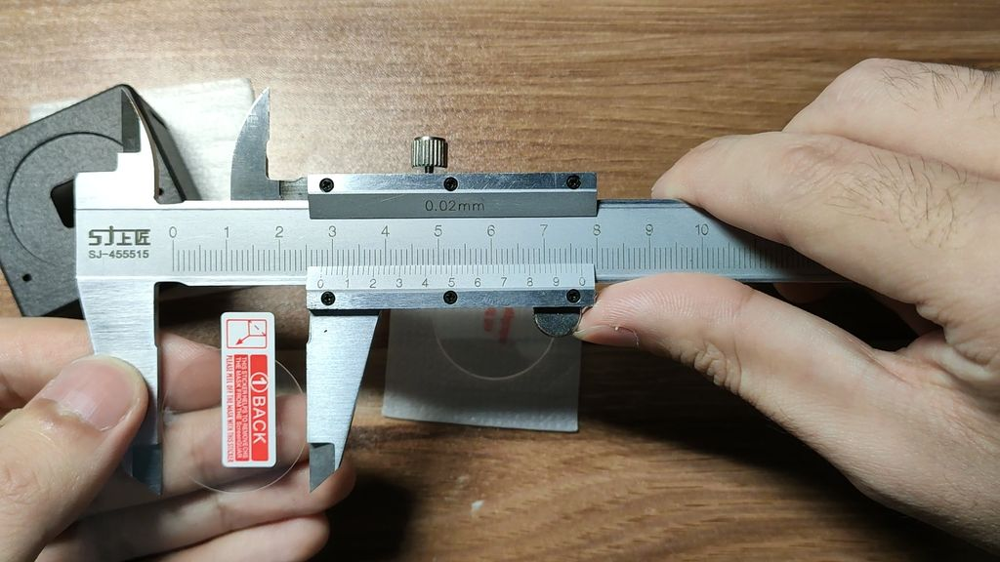  
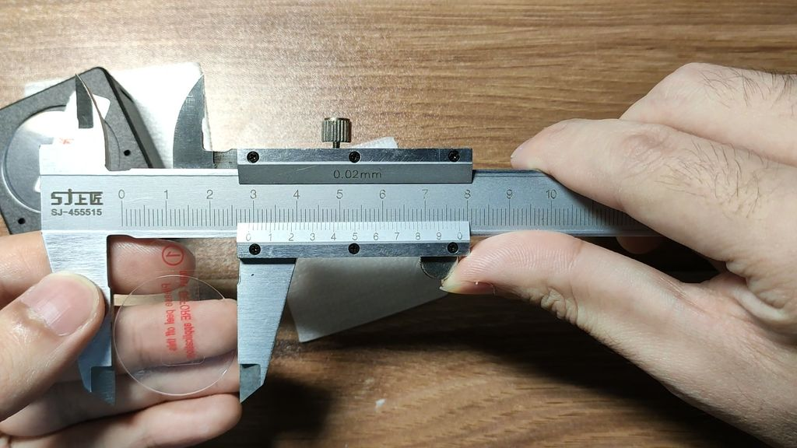  
钢化膜内层的膜用小刀稍微使劲就能划出痕迹  
  
再使点劲把膜划烂，撕掉就行，安全第一，注意别伤到手，也别把钢化玻璃弄碎了  
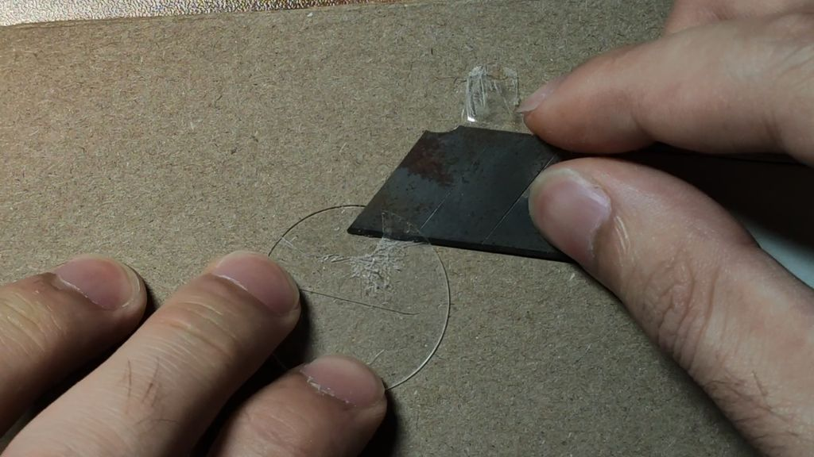  

## 外壳组装说明
先说一个很严重的问题：铝合金外壳会干扰电容屏，从电容屏的原理上讲，这是无法避免的。我尝试了加厚电容屏下胶带厚度，使电容屏尽量远离金属边框，但依然有干扰，所以最后无奈只能使用3D打印的边框，视频中也能看到，成品前面两个外壳用的是铝合金，后面屏幕边框用的是尼龙，外观有点丑。如果有行之有效的改善电容屏干扰的方法，欢迎与大家分享！  

CNC外壳前期准备工作  
* 对于CNC外壳定义装镜头玻璃的为前壳，中间的为侧壳（中壳），装屏幕的为后壳
* 使用透明环氧胶将前壳和侧壳粘在一起，前壳和侧壳要一次性粘接到位
* 粘接时必然会有部分胶水溢出，溢出的胶水需要及时处理，一旦胶水固化就难办了
* 个人经验，环氧胶的初步固化时间约5分钟（具体时长看说明书），涂胶后等个两分钟左右，这时胶水的流动性变差但有没有完全凝固，使用类似牙签之类的有一定硬度且不会划伤外壳的东西尽快把溢出的胶水扣掉
* 等待24小时完全固化后你就得到了一个外壳

CNC外壳相比与3D打印外壳少了一些如螺丝柱之类的结构，这样做的目的是为了降低加工费用，也许我这样设计的CNC外壳不够合理，欢迎提出改进意见。  
其余步骤3D打印外壳的组装步骤和CNC外壳的组装步骤基本一致（定义上一步粘好的CNC外壳为前壳，装屏幕的为后壳）
* 对于CNC外壳，购买若干5mm高的m2螺丝柱，对照PCB的螺丝孔位置，使用环氧胶粘在前壳上，待胶水完全固化后再进行下一步
* 对于CNC外壳，如图所示，找一些小塑料块之类的东西粘在距离前边框3mm处，塑料块不要太高，以免碰到副板上的元件，这里的塑料块可以粘死（这一结构是为了辅助固定副板PCB，可参考3D打印的结构）
  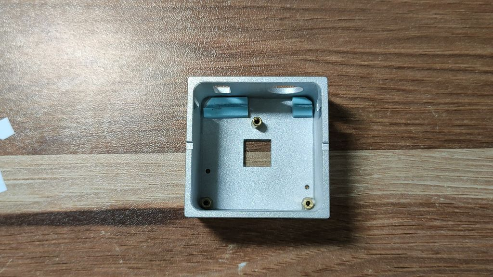
* 粘钢化膜
* home键和PCB上的按键之间大约有1mm的空隙，可以在home键后粘一小块硬纸板来填补间隙，或者贴片时选用高度为1.6mm的按键
* 使用胶带把home粘在外壳上，别粘死，主要目的是保证home键可以按得动，但又不会按几次以后就歪了
  
* 需要喇叭的，安装喇叭，3D打印外壳上预留有安装位置，CNC外壳就凭感觉差不多是这个位置就行
* 先插好副板的排线再将副板随开关帽一起装入外壳
* 对于CNC外壳，如图所示，找一些小塑料块之类的东西分别粘在USB插口处和SD卡插口处，塑料块高度约3mm，这里的塑料块不要粘死，除非你以后不打算拆开维修了（这一结构是为了辅助固定副板PCB，3D打印的外壳不需要这个结构，后壳上突出的柱子起相同作用）
  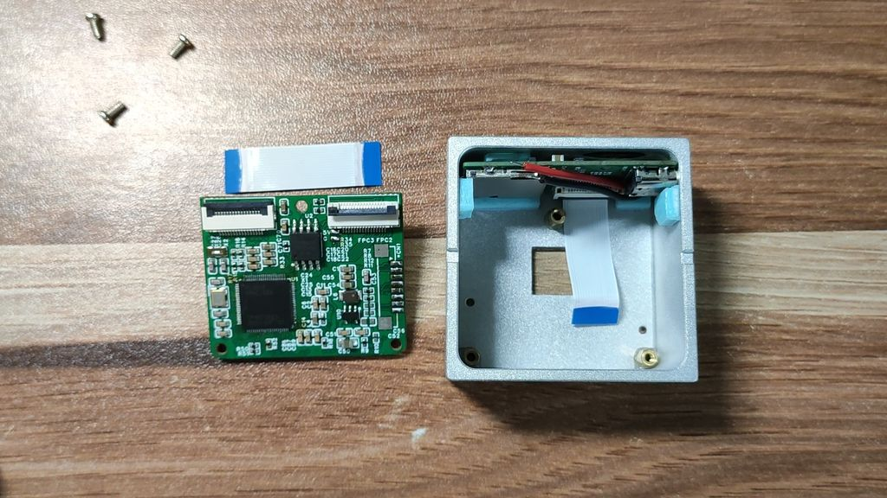
* 先插好屏幕排线和副板排线，再将主板装入外壳并用螺丝固定
  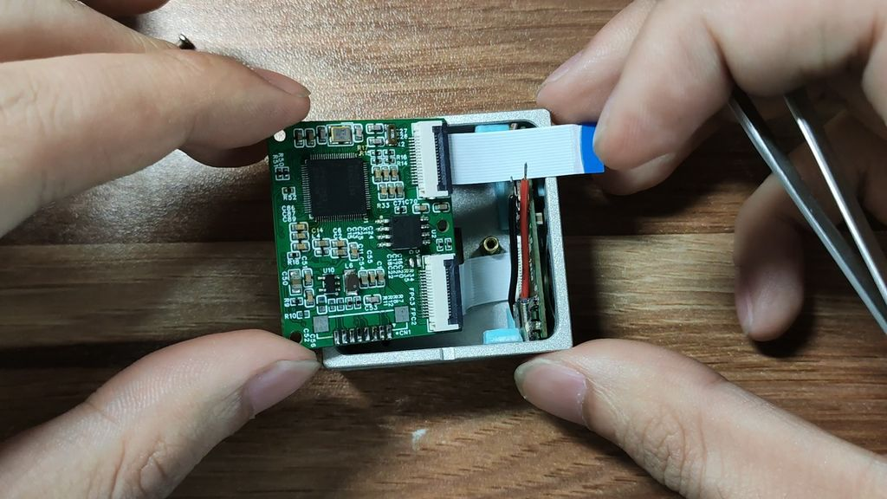
* 对主板上的所有器件用胶带做绝缘，仅露出主控
  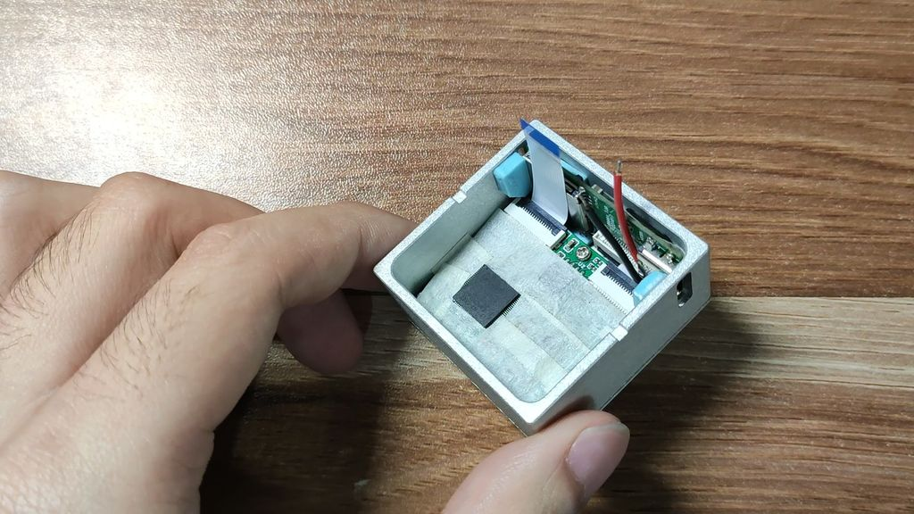
* 给主控粘铜箔胶带辅助散热（手机上的哪种石墨散热贴也行），注意铜箔胶带一定要粘到外壳上，目的是提高散热效率。3D打印外壳的散热效果肯定差，没办法
  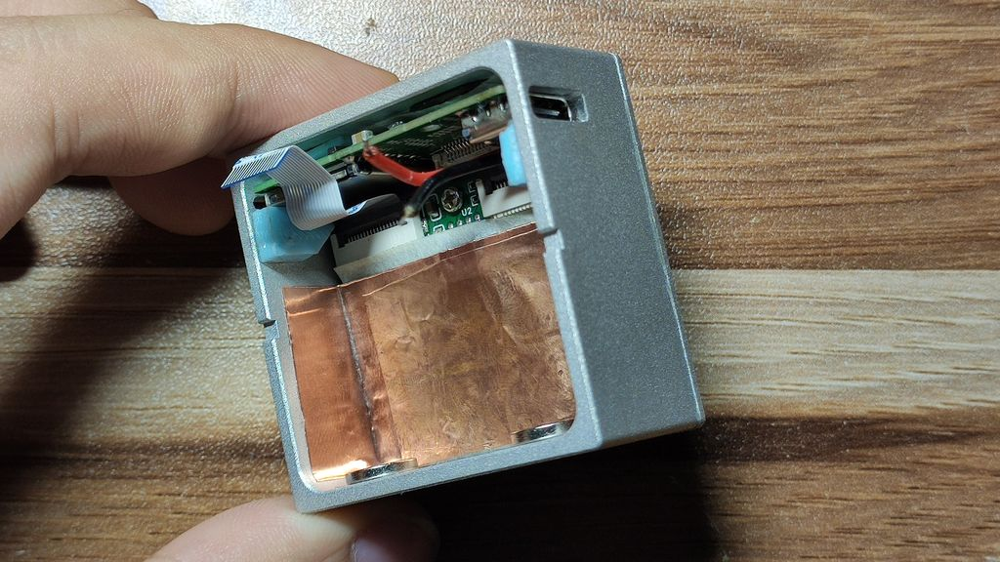
* 再次强调，主控的发热量比较大，不辅助散热的话温度会直接飙升到100度以上，手册中建议工作温度不要超过95度
* 使用宽度为3mm左右的双面胶把屏幕粘在后壳上
* 安装电池，连接屏幕排线
* 使用双面胶将后壳和前壳粘在一起，同样不要粘死，除非你以后不打算拆开维修了。注意到样机的左右边框有两个缺口吗？就是为了方便我自己从这里撬开屏幕进行后期维修预留的
* 大功告成


# 软件开发
海思的SDK可以说是我目前接触到的文档资料最好的SDK，没有之一。他的文档规范、覆盖面广，开发过程中90%的问题都能通过文档解决。其他芯片例如全志、君正等仍然存在一定差距。  

软件开发第一步搭建开发环境，按照上文说明下载指定版本SDK，并根据SDK内的文档说明安装交叉编译器、释放源码等。  

软件开发没什么好说的，看代码、看注释吧，本章节只挑一些比较重要的内容进行说明。  

## 字体
中文字体选择了一款非常著名的开源字体 HarmonyOS_Sans_SC_Regular，英文字体则选择了程序员中较受欢迎的 Inconsolata-Regular。  

目前我适配了 stb_truetype 作为 LVGL 的字体引擎。我前期开发用的 LVGL v8.3，这个版本官方还没适配 stb_truetype。但后来（大概是2022年9月） LVGL 的 master 分支上官方已经适配好了，叫做 Tiny TTF font engine。我在本项目中就用自己适配的字体引擎，如果没有特殊需求不会切换到 Tiny TTF font engine。  

### 字体裁剪
HarmonyOS_Sans 的具体字符数我不清楚，但有一定可以肯定，它涵盖的字符非常多。对于嵌入式设备来说，使用将近8MB的空间来存储一款字体是一件非常奢侈的事情。查阅相关资料可知中文一级汉字有3755个，足以覆盖日常使用中99%的场景，因此我对它进行了裁剪，只保留一级汉字以及GB2312中前三区的符号，裁剪后的体积只有900KB左右，经过jffs文件系统压缩后实际占用的体积会更小。  

裁剪工具用的是 https://github.com/DeronW/minify-font  
它对应的客户端是 https://ecomfe.github.io/fontmin/#feature  
具体使用方法请自行查阅工具内的文档。  

注：我将裁剪后的字体命名为`HarmonyOS_Sans_SC_Regular_L1.ttf`，其中L1代表一级汉字  

## 如何制作升级包
可以参考 `firmware\camera_img\update_pack.tar` 来制作，这里说几个关键点  
1. 升级的原理就是先删除`/home/app/`，再把升级包内的东西解压到`/home/app/`中，具体细节请查看源码
2. 看清楚升级包的格式`update_pack.tar`，看清除了，是`tar`，也就是只打包不压缩，tar命令的使用请自学
3. 升级包内不包含`app/`这个目录，别套娃了
4. 系统启动后会执行`/etc/init.d/S99user_app`这个脚本，这个脚本只做了一件事就是执行`/home/app/run.sh`，因此如果想要开机启动其他你自己编写的程序修改`/home/app/run.sh`就行
5. 不想使用我的这种升级逻辑的请自行修改相关代码，反正开源了，想咋改都行

## 如何打包rootfs
基于官方的`"Hi3516EV200_SDK_V1.0.1.2\package\rootfs_uclibc.tgz`修改而来，添加了以下内容  
```
/
├── etc
│   └── init.d
│       └── S99user_app                             # 这是我自己添加的开机启动脚本
└── home
    ├── app                                         # 自己编译的程序和相关文件都放这里
    │   ├── camera
    │   ├── font
    │   │   ├── HarmonyOS_Sans_SC_Regular_L1.ttf
    │   │   └── Inconsolata-Bold.ttf
    │   ├── lib
    │   │   ├── libsns_ov5640.so
    │   │   └── ssp_st7789_drv.ko
    │   └── run.sh
    ├── ko                                          # 直接复制海思官方SDK内的对应文件夹
    │   ├── *.ko                                    # 存放海思官方SDK内的ko文件
    │   └── load3516ev200                           # 这个脚本我基于官方修改了MMZ
    └── lib                                         # 直接复制海思官方SDK内的对应文件夹
        └── *.so
```
制作方法  
1. 按官方文档安装必要的工具，例如`mkfs.jffs2`
2. 可以自己从头编译busybox，没有特殊需求直接使用官方的`rootfs_uclibc.tgz`更省事，解压到任意目录例如`./my_rootfs/`
3. 记得 `chmod -R 777 ./my_rootfs/` 否则某些程序无法正常运行，甚至不能自动登录，不能串口输入
4. 添加或修改自己所需要的文件
5. 使用如下命令制作rootfs `mkfs.jffs2 -d ./my_rootfs/ -l -e 0x10000 -o ./my_rtfs.jffs2`

## 另一种升级方式
海思官方还提供了一种方式：SD卡放入相关升级文件，按住UPDATE键开机，系统会自动升级。  
我保留了这种升级方式，录像键就是UPDATE键。详细使用方法请参考SDK内的文档，这里不再赘述。  

## 屏幕刷新率
详细内容可以看《SPI优化》这个文档。  
目前为了降低CPU使用率，故意将LVGL的调用频率和实时预览画面的刷新率降低一些，以保留更多的CPU资源供录像线程使用。毕竟录像功能是最重要的，总不能为了GUI显示流畅而牺牲录像的完整性吧？  

## 图像传感器相关
你问我为什么不使用例如imx307、imx335、sc4236之类的图像传感器？我也想用啊，这些传感器官方SDK里面就把驱动写好了，连ISP都调好了，画质绝对刚刚的！但是网上搜了一番，只能找到IPC通用的镜头模块，别的不说，镜头光学组件的长度就已经超过机身厚度了，我也很无奈啊！所以只能找这种小型镜头，所有能找到的这些镜头里面只有OV5640是支持MIPI输出的，而且也只有OV5640是资料最全的，虽然还有一些神秘寄存器根本找不到说明，但这已经是最好的选择了。还有很重要一点OV5640采用YUV输出模式时可以使用内置的ISP，网上也能找到一些OV5640的ISP配置，我个人没有能力开发海思的ISP。  

首先在这里感谢CSDN一位网友的文章[《Hi3518EV300 OV5640 mipi YUV 调试记录》](https://blog.csdn.net/weixin_43024085/article/details/109478393)  
对我来说这篇文章最重要的是排除了我一个疑惑：Hi3516EV200支持MIPI YUV输入吗？答案是官方SDK里说不支持，但是这位朋友硬是调通了！  
Hi3518EV300 和 Hi3516EV200可以认为主要功能基本一致，有了这篇文章的启发，我也有信心在 Hi3516EV200 上调通 OV5640 MIPI YUV！  

这里直说最重要的修改点，其他参数完全照搬上面这篇文章，至于为什么这样的参数能用，我也不知道，官方说了不支持MIPI YUV输入，这样的配置参数完全是蒙出来的。  

VI模块的相关配置  
```
combo_dev_attr_t MIPI_2lane_CHN0_SENSOR_OV5640_8BIT_NOWDR_ATTR =
{
    .devno = 0,
    .input_mode = INPUT_MODE_MIPI,
    .data_rate = MIPI_DATA_RATE_X1,
    // 手册中说明3516EV200不支持MIPI输入YUV
    // 自己摸索出来的，这里配置的宽度必须是实际宽度的2倍，否则图像缺失
    .img_rect = {0, 0, 3840, 1080},

    {
        .mipi_attr =
        {
   			DATA_TYPE_YUV422_8BIT,
            HI_MIPI_WDR_MODE_NONE,
            {0, 2, -1, -1}
        }
    }
};
```

海思媒体模块初始化完成以后需要修改的寄存器  
```
// HIMPP_VENC_H265_H264 内会改变一些寄存器，OV5640初始化只能放它后面
// VICAP 寄存器，自己摸索出来的配置，手册中说明3516EV200不支持MIPI输入YUV，瞎调给调通了
himm(0x11001010, 0xFF000000);
himm(0x11001014, 0xFF000000);
himm(0x11001040, 0x80000004);
```

## 内存相关
海思将物理内存分为了内核内存和媒体内存，目前设置的是内核36MB、媒体28MB，如需修改一定要详细阅读SDK内相关文档，这里涉及到的东西非常多。  

## 关于u-boot和kernel修改的代码
u-boot 主要修改了两点  
* 增加开机 Logo
* 修改 W25Q128JVSIQ 这颗 Flash 的工作模式，将4线模式改为1线模式，并将时钟频率降低

kernel 主要修改一点  
* 修改 W25Q128JVSIQ 这颗 Flash 的工作模式，将4线模式改为1线模式，并将时钟频率降低

这里解释一下为什么要修改 u-boot 和 kernel 的 Flash 驱动：目前推测是我画的PCB有问题，小概率情况下，不用改驱动系统就能正常启动，大概率不能正常启动，怀疑是SPI时钟太高、有干扰之类的。所以为了确保系统正常启动修改了工作模式和时钟频率。  

## 其他内容
doc 目录下还有几篇文章，想要深入学习的小伙伴可以看看，这些篇文章我也发布在了其他平台。  
[使用NEON指令加速RGB888和RGB565的相互转换](doc\使用NEON指令加速RGB888和RGB565的相互转换.md)  
[SPI优化](doc\SPI优化.md)  


# Q&A
## 能不能做的像 Action 2 一样长按开机、长按关机？
可以，方案都设计好了，但我没做（别问，问就是懒）。这里给出我的设计方案，有兴趣的话可以自己尝试，有更好的方案也欢迎讨论。  
电源控制芯片用STC8G1K08A，DFN封装，一个IO用来控制MOS管，做为电源主控引脚，一个IO接按键，这个IO必须支持外部中断，一个IO接到Hi3516。  
STC芯片内编程，主要功能为：  
1. 按键外部中断唤醒STC，不足5秒进入掉电模式，超过5秒控制MOS管导通使Hi3516开机
2. 短按信号，例如单击、双击、2秒以内的长按原样传输给Hi3516，用来做拍照、拍摄等功能的控制
3. 开机状态下长按5秒，控制MOS管截止，STC进入掉电模式
4. 关机的逻辑可以优化一下，带来更好的使用体验。开机状态下长按5秒，将这个长按的信号也传输给Hi3516，Hi3516收到长达5秒的信号说明这是要关机，在屏幕上显示关机字样或关机动画，STC延时几秒后控制MOS管截止并进入掉电模式

## 能不能用 Hi3518EV300 替换？
可以，改硬件什么的就不说了，这里主要说明换芯片的优缺点。  
对比：3518相比于3516去掉了eth功能和对应引脚改为电源管理相关功能和对应引脚，其余功能基本一致  
优点：3518自带电源管理，不用外接其他芯片就能很方便地实现长按开关机功能，因为款芯片的定位就是消费级电子产品，而不是3516的消费级网络摄像机  
缺点：没有eth，开发会有比较麻烦，比如你的程序不能通过网络挂载，这也就意味着你每次运行都要将程序拷到SD卡里，如果要用网络（比如使用gdbserver调试这种情况），那么你必须开发usb网卡驱动  

## 能不能做视频回放？
当然能做，你看硬件上我都专门为回放功能预留了功放芯片和喇叭，为什么我没做呢？最重要的是开发工作量比较大，挺费头发的，其次这么小个屏幕看回放不难受吗，所以我就砍掉了这个功能？如果你有兴趣的话，可以按照以下方案自己开发。  
首先 Hi3516EV200 没有硬件解码器，回放只能使用软件解码器，其次芯片的性能也有限，据我查到的资料，在某款架构和主频相似的芯片上，使用ffmpeg最高只能实现h264 640x360 12fps的解码。  
结合屏幕刷新率的情况考虑，我设计的解码方案是再开启一路h264的编码器，编码出240x180 15fps的视频，将这个视频保存下来用做回放。这其中还有很多开发工作要做，比如调裁剪ffmpeg并交叉编译、开发GUI等，工作量还不小。  

## 屏幕亮度能不能控制？
可以，屏幕背光引脚接在了PWM上，不过目前只有开关背光的功能，如有需要请自行开发。  

## 如果我想开发wifi模块应该怎么做？
海思SDK内有一篇文档专门讲wifi的使用，芯片型号、编译方法写得很清楚。  

## 安装完SDK发现没有GDB，应该怎么办？
SDK确实没有提供gdb，需要自己编译，具体方法请参考`arm-himix100-linux.tgz\gdb_readme_cn.txt`  

## 为什么配置开发环境遇到了XXX的问题？
你真的按照海思SDK内的文档操作了吗？  
文档中要求你下载的东西都下载了吗？  
什么？你用的是CentOS？为什么不按照文档的要求用Ubuntu？  
脚本不能执行？脚本里写的是`#!/bin/bash`还是`#!/bin/dash`？  
脚本又不能执行？换行符用的是`\n`还是`\r\n`？  
差不多得了，别太过分，你搁这儿十万个为什么呢？自己找答案去！  

## 能不能用旧手机上拆下来的摄像头？
别闹，你是认真的吗？  

## 我想要XXX功能，能不能帮忙开发？
别闹，自己动手丰衣足食！  

## 能不能提供SDK的下载地址？
别闹，谁知道你是不是海思派来的卧底？  


# 关于留言提问
1. 留言第一句问“在吗”，绝对不回复
基本社交礼仪懂不懂？最简单的：表明身份（我是一名程序员；我是一名业余电子爱好者没有编程经验），表明目的（我想要复刻、我买不到元件、我遇到了问题、我发现你的代码有bug），详细说明（我买不到XXX，商品已经下架了；我遇到了问题，串口打印如下XXX；你的bug是XXX，复现的方法是XXX）
1. 提问描述不清的绝对不回复
举两个例子，你猜我会回复哪一种？1.不开机，帮忙看一下。2.不开机，卡在开机Logo，硬件检查过没问题，程序按照说明的方式烧录了，启动后卡在uboot了，uboot代码没有任何修改，尝试换过主控芯片、修改启动电阻、烧录原版镜像等方法都无效，flash型号为XXXX，uboot启动日志如下XXX
3. 能在文档中找到答案的问题大概率不回复
找不到是哪篇文档的我可以指引你去看，文档看不懂可以讨论，文档一个字都不看的你想干啥？
4. 关于技术讨论的尽力回复


# 存在的问题

## 关于月份日期的问题
设置时间日期是一个使用频率很低，但是开发却较麻烦的功能，月份天数不对的问题使用过程中注意就行，暂不修复。  

## 录像开始的前几帧数据异常
确实存在这个问题，应该是第一个I帧前面丢失了PPS数据，会导致短暂的花屏，以后我也许会修吧。  

## 程序退出时偶现段错误
调试过程中正常退出camera程序时有很小概率导致段错误，暂时没有抓到coredump，正常使用都是直接关机，目前而言这个问题暂不影响使用。  

## I2C时钟问题
目前I2C时钟为100KHz，MPU6050的数据量又稍微有点多，会导致I2C占用比较多的内核态CPU（大约20%），我原本想改到400KHz来提升通信效率，但按照海思文档修改后I2C直接没信号输出了，也不知道是哪里出了问题。  
